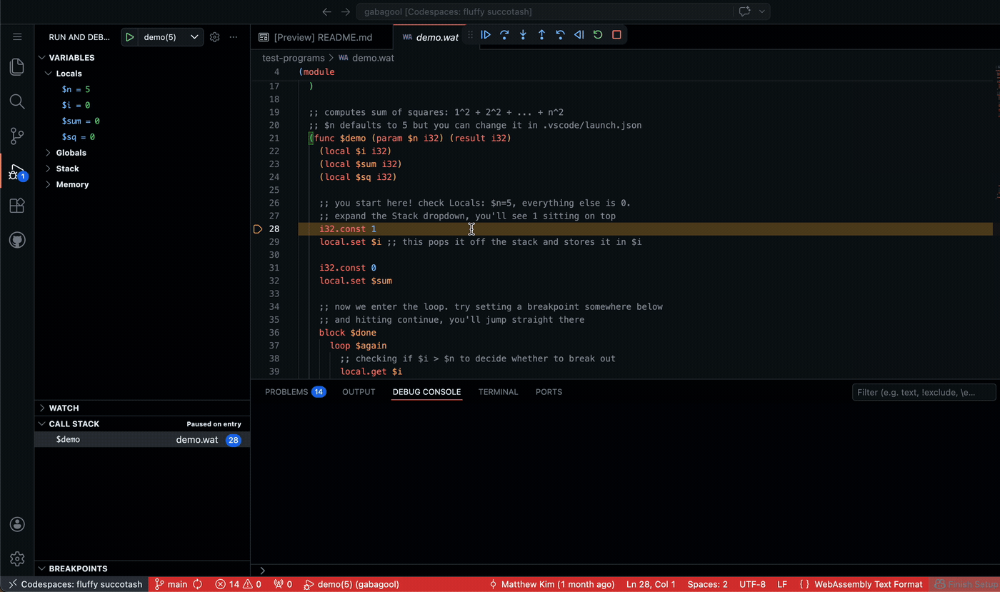

# gabagool-debug-adapter

A DAP server that enables time travel debugging for WebAssembly programs.

Currently, the debugger steps through `.wat` source files. Supporting DWARF debug symbols to step through the original source code is a future (and lofty) goal.

<br>

# Try it in one click

[Open this repo in a GitHub Codespace](https://codespaces.new/friendlymatthew/gabagool)

Wait for the container to build and press `F5`

# Local install for VSCode

```sh
# build the adapter and copy the binary into the extension dir
./gabagool-debug-adapter/local-install.sh

# symlink the extension into vscode
ln -sfn "$(pwd)/gabagool-debug-adapter" ~/.vscode/extensions/gabagool-debug

# reload vscode (cmd + shift + p -> "Developer: reload window")
# open any .wat file and press F5, then pick a program from the dropdown
```

# Reading

https://microsoft.github.io/debug-adapter-protocol/specification.html<br>
